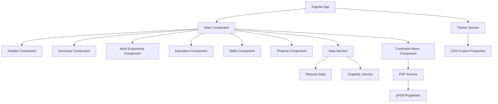

# Design Document

## Overview

Angular CV uygulaması, mevcut Next.js tabanlı minimalist CV uygulamasının Angular 20 ile yeniden tasarlanmış versiyonudur. Uygulama, Angular 20'nin en güncel özelliklerini (Standalone Components, Signals, yeni HttpClient, Control Flow Syntax) kullanarak tek sayfalık, responsive, yazdırma dostu bir CV deneyimi sunar.

### Temel Tasarım Prensipleri

- **Minimalist Tasarım**: Temiz, profesyonel görünüm
- **Performance First**: Lazy loading, OnPush change detection
- **Accessibility**: WCAG 2.1 AA uyumluluğu
- **Mobile First**: Responsive tasarım yaklaşımı
- **Print Optimized**: Yazdırma için özel CSS stilleri

## Architecture

### Genel Mimari



### Klasör Yapısı

```
src/
├── app/
│   ├── components/
│   │   ├── header/
│   │   ├── summary/
│   │   ├── work-experience/
│   │   ├── education/
│   │   ├── skills/
│   │   ├── projects/
│   │   ├── command-menu/
│   │   └── ui/
│   │       ├── button/
│   │       ├── card/
│   │       ├── avatar/
│   │       ├── badge/
│   │       └── skeleton/
│   ├── services/
│   │   ├── data.service.ts
│   │   ├── graphql.service.ts
│   │   ├── pdf.service.ts
│   │   └── theme.service.ts
│   ├── models/
│   │   └── resume.interface.ts
│   ├── data/
│   │   └── resume-data.ts
│   └── styles/
│       ├── globals.scss
│       ├── print.scss
│       └── variables.scss
├── assets/
│   ├── images/
│   └── icons/
└── environments/
```

## Components and Interfaces

### Ana Bileşenler

#### 1. App Component (Standalone)
- **Sorumluluk**: Ana layout ve routing
- **Özellikler**: 
  - Error boundary wrapper
  - Global loading state
  - Theme provider

```typescript
@Component({
  selector: 'app-root',
  standalone: true,
  imports: [CommonModule, RouterOutlet, HeaderComponent, ...],
  template: `
    <main class="container mx-auto p-4 print:p-11 md:p-16">
      <div class="max-w-2xl mx-auto space-y-8 bg-white print:space-y-4">
        <app-header />
        <app-summary />
        <app-work-experience />
        <app-education />
        <app-skills />
        <app-projects />
      </div>
      <app-command-menu />
    </main>
  `
})
```

#### 2. Header Component
- **Sorumluluk**: Kişisel bilgiler, avatar, iletişim bilgileri
- **Signals**: `resumeData = signal<ResumeData | null>(null)`
- **Özellikler**: Responsive avatar, sosyal medya linkleri

#### 3. Command Menu Component
- **Sorumluluk**: Klavye navigasyonu (Cmd/Ctrl+K)
- **Özellikler**: 
  - Keyboard event handling
  - PDF export trigger
  - Quick navigation
  - Print functionality

#### 4. PDF Service Integration
- **Kütüphane**: `jspdf` + `html2canvas` veya `puppeteer`
- **Özellikler**: 
  - Print-optimized styling
  - Custom page breaks
  - Font embedding

### UI Component Library

Angular Material'e alternatif olarak, shadcn/ui tarzında özel UI bileşenleri:

#### Button Component
```typescript
@Component({
  selector: 'app-button',
  standalone: true,
  template: `
    <button 
      [class]="computedClasses()"
      [disabled]="disabled()"
      (click)="onClick.emit($event)">
      <ng-content />
    </button>
  `
})
export class ButtonComponent {
  variant = input<'default' | 'outline' | 'ghost'>('default');
  size = input<'sm' | 'default' | 'lg' | 'icon'>('default');
  disabled = input<boolean>(false);
  onClick = output<MouseEvent>();
  
  computedClasses = computed(() => {
    // CVA benzeri class hesaplama
  });
}
```

#### Card Component
```typescript
@Component({
  selector: 'app-card',
  standalone: true,
  template: `
    <div [class]="cardClasses()">
      <ng-content />
    </div>
  `
})
```

## Data Models

### Resume Interface

```typescript
export interface ResumeData {
  name: string;
  initials: string;
  location: string;
  locationLink: string;
  about: string;
  summary: string;
  avatarUrl: string;
  personalWebsiteUrl: string;
  contact: ContactInfo;
  education: Education[];
  work: WorkExperience[];
  skills: string[];
  projects: Project[];
}

export interface ContactInfo {
  email: string;
  tel: string;
  social: SocialLink[];
}

export interface SocialLink {
  name: string;
  url: string;
  icon: IconType;
}

export interface WorkExperience {
  company: string;
  link: string;
  badges: string[];
  title: string;
  start: string;
  end: string | null;
  description: string;
}

export interface Project {
  title: string;
  techStack: string[];
  description: string;
  link?: {
    label: string;
    href: string;
  };
}
```

### Services

#### Data Service
```typescript
@Injectable({ providedIn: 'root' })
export class DataService {
  private resumeData = signal<ResumeData>(RESUME_DATA);
  
  getResumeData = computed(() => this.resumeData());
  
  updateResumeData(data: Partial<ResumeData>) {
    this.resumeData.update(current => ({ ...current, ...data }));
  }
}
```

#### GraphQL Service
```typescript
@Injectable({ providedIn: 'root' })
export class GraphQLService {
  private httpClient = inject(HttpClient);
  
  getResumeData(): Observable<ResumeData> {
    const query = `
      query GetResume {
        me {
          name
          about
          # ... diğer alanlar
        }
      }
    `;
    
    return this.httpClient.post<{data: {me: ResumeData}}>('/graphql', {
      query
    }).pipe(
      map(response => response.data.me)
    );
  }
}
```

#### PDF Service
```typescript
@Injectable({ providedIn: 'root' })
export class PDFService {
  async generatePDF(elementId: string, filename: string): Promise<void> {
    const element = document.getElementById(elementId);
    if (!element) return;
    
    // Print stilleri uygula
    document.body.classList.add('print-mode');
    
    const canvas = await html2canvas(element, {
      scale: 2,
      useCORS: true,
      allowTaint: true
    });
    
    const pdf = new jsPDF('p', 'mm', 'a4');
    const imgData = canvas.toDataURL('image/png');
    
    pdf.addImage(imgData, 'PNG', 0, 0, 210, 297);
    pdf.save(filename);
    
    // Print stilleri kaldır
    document.body.classList.remove('print-mode');
  }
}
```

## Error Handling

### Error Boundary Implementation

Angular 20 ile error handling:

```typescript
@Injectable()
export class GlobalErrorHandler implements ErrorHandler {
  handleError(error: any): void {
    console.error('Global error:', error);
    // Error tracking service'e gönder
  }
}

// Component level error handling
@Component({
  template: `
    @if (errorState()) {
      <div class="error-boundary">
        <h2>Bir hata oluştu</h2>
        <button (click)="retry()">Tekrar Dene</button>
      </div>
    } @else {
      <ng-content />
    }
  `
})
export class ErrorBoundaryComponent {
  errorState = signal<boolean>(false);
  
  retry() {
    this.errorState.set(false);
  }
}
```

## Testing Strategy

### Unit Testing
- **Framework**: Jest + Angular Testing Library
- **Coverage**: %90+ kod kapsamı
- **Bileşen Testleri**: Her bileşen için isolated testler
- **Service Testleri**: Mock data ile service testleri

### E2E Testing
- **Framework**: Playwright
- **Senaryolar**: 
  - CV görüntüleme
  - PDF export
  - Responsive design
  - Klavye navigasyonu
  - Print functionality

### Test Örnekleri

```typescript
// Component Test
describe('HeaderComponent', () => {
  it('should display user name and contact info', async () => {
    const { fixture } = await render(HeaderComponent, {
      componentInputs: { resumeData: mockResumeData }
    });
    
    expect(screen.getByText(mockResumeData.name)).toBeInTheDocument();
    expect(screen.getByText(mockResumeData.about)).toBeInTheDocument();
  });
});

// Service Test
describe('PDFService', () => {
  it('should generate PDF with correct filename', async () => {
    const service = TestBed.inject(PDFService);
    const spy = jest.spyOn(service, 'generatePDF');
    
    await service.generatePDF('cv-content', 'John_Doe_CV.pdf');
    
    expect(spy).toHaveBeenCalledWith('cv-content', 'John_Doe_CV.pdf');
  });
});
```

## Performance Optimizations

### Lazy Loading
- Route-based lazy loading
- Component lazy loading
- Image lazy loading

### Change Detection
- OnPush strategy for all components
- Signals for reactive state management
- Immutable data patterns

### Bundle Optimization
- Tree shaking
- Code splitting
- Preloading strategies

### Caching
- HTTP interceptor for API caching
- Service worker for offline support
- Browser caching headers

## Styling Architecture

### CSS Framework
- **Tailwind CSS**: Utility-first approach
- **Custom Properties**: CSS variables for theming
- **SCSS**: Component-specific styles

### Print Styles
```scss
@media print {
  .print-hidden {
    display: none !important;
  }
  
  .print-force-new-page {
    page-break-before: always;
  }
  
  body {
    font-size: 12px;
    line-height: 1.4;
  }
  
  .container {
    max-width: none;
    padding: 0;
  }
}
```

### Theme System
```typescript
@Injectable({ providedIn: 'root' })
export class ThemeService {
  private currentTheme = signal<'light' | 'dark'>('light');
  
  toggleTheme() {
    this.currentTheme.update(theme => theme === 'light' ? 'dark' : 'light');
    this.applyTheme();
  }
  
  private applyTheme() {
    const theme = this.currentTheme();
    document.documentElement.setAttribute('data-theme', theme);
  }
}
```

## SEO and Accessibility

### Meta Tags
- Angular Universal for SSR
- Dynamic meta tag updates
- Open Graph ve Twitter Card support
- JSON-LD structured data

### Accessibility
- ARIA labels ve roles
- Keyboard navigation
- Screen reader support
- Color contrast compliance
- Focus management

### Implementation
```typescript
@Injectable({ providedIn: 'root' })
export class SEOService {
  constructor(
    private meta: Meta,
    private title: Title,
    private document: Document
  ) {}
  
  updateSEO(data: ResumeData) {
    this.title.setTitle(`${data.name} - Resume`);
    this.meta.updateTag({ name: 'description', content: data.about });
    this.meta.updateTag({ property: 'og:title', content: `${data.name} - Resume` });
    this.meta.updateTag({ property: 'og:description', content: data.about });
    
    // JSON-LD structured data
    const structuredData = this.generateStructuredData(data);
    this.addStructuredData(structuredData);
  }
}
```

## Development Workflow

### Build Process
- **Development**: `ng serve` with HMR
- **Production**: `ng build --configuration=production`
- **Testing**: `ng test` + `ng e2e`
- **Linting**: ESLint + Prettier

### CI/CD Pipeline
1. Code commit
2. Automated tests
3. Build verification
4. Deployment to staging
5. E2E tests
6. Production deployment

### Code Quality
- ESLint rules
- Prettier formatting
- Husky pre-commit hooks
- SonarQube code analysis