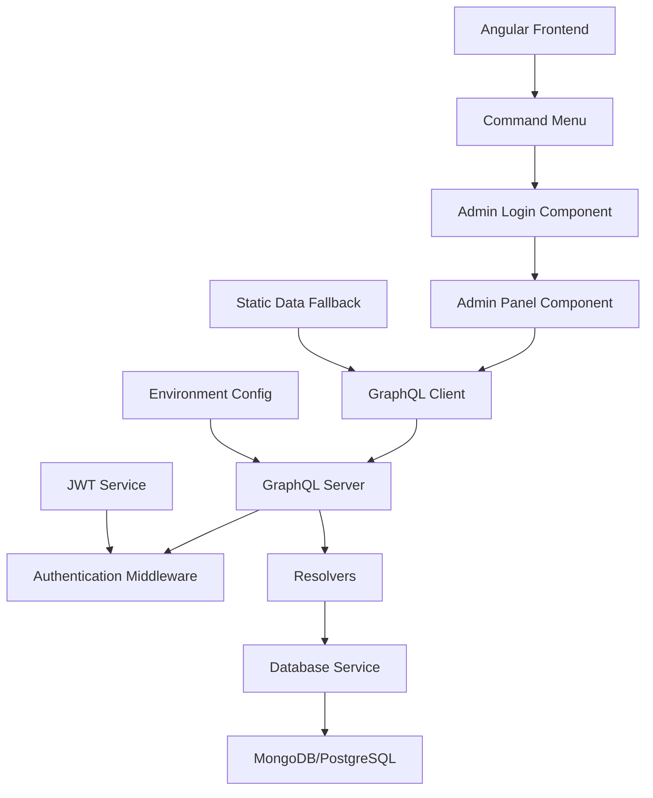
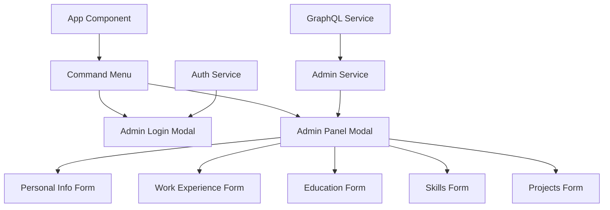

# Design Document

## Overview

GraphQL CV Management sistemi, mevcut Angular CV uygulamasına admin paneli ve dinamik veri yönetimi ekleyerek, CV verilerinin production ortamında GraphQL API üzerinden güncellenebilmesini sağlar. Sistem, command menu üzerinden erişilebilen güvenli bir admin paneli ve backend'de kalıcı veri saklama çözümü içerir.

### Temel Tasarım Prensipleri

- **Security First**: Authentication ve authorization
- **User-Friendly Admin Panel**: Teknik bilgi gerektirmeyen interface
- **Real-time Updates**: Anında veri senkronizasyonu
- **Production Ready**: Scalable ve maintainable architecture
- **Fallback Strategy**: Database bağlantı sorunlarında statik data kullanımı

## Architecture

### Genel Mimari



### Component Architecture



## Components and Interfaces

### Frontend Components

#### 1. Admin Login Component
```typescript
@Component({
  selector: 'app-admin-login',
  standalone: true,
  template: `
    <div class="fixed inset-0 bg-black/50 flex items-center justify-center z-50">
      <div class="bg-white p-6 rounded-lg shadow-xl max-w-md w-full mx-4">
        <h2 class="text-xl font-semibold mb-4">Admin Login</h2>
        <form (ngSubmit)="onSubmit()" [formGroup]="loginForm">
          <div class="space-y-4">
            <div>
              <label class="block text-sm font-medium mb-1">Username</label>
              <input 
                type="text" 
                formControlName="username"
                class="w-full px-3 py-2 border rounded-md"
              />
            </div>
            <div>
              <label class="block text-sm font-medium mb-1">Password</label>
              <input 
                type="password" 
                formControlName="password"
                class="w-full px-3 py-2 border rounded-md"
              />
            </div>
            @if (errorMessage()) {
              <div class="text-red-600 text-sm">{{ errorMessage() }}</div>
            }
            <div class="flex gap-2">
              <button 
                type="submit" 
                [disabled]="isLoading()"
                class="flex-1 bg-blue-600 text-white py-2 rounded-md hover:bg-blue-700 disabled:opacity-50"
              >
                {{ isLoading() ? 'Logging in...' : 'Login' }}
              </button>
              <button 
                type="button" 
                (click)="onCancel()"
                class="flex-1 bg-gray-300 text-gray-700 py-2 rounded-md hover:bg-gray-400"
              >
                Cancel
              </button>
            </div>
          </div>
        </form>
      </div>
    </div>
  `
})
export class AdminLoginComponent {
  loginForm = this.fb.group({
    username: ['', Validators.required],
    password: ['', Validators.required]
  });
  
  isLoading = signal(false);
  errorMessage = signal<string | null>(null);
  
  constructor(
    private fb: FormBuilder,
    private authService: AuthService,
    private adminService: AdminService
  ) {}
  
  async onSubmit() {
    if (this.loginForm.valid) {
      this.isLoading.set(true);
      this.errorMessage.set(null);
      
      try {
        const { username, password } = this.loginForm.value;
        await this.authService.login(username!, password!);
        this.adminService.openAdminPanel();
        this.onCancel();
      } catch (error) {
        this.errorMessage.set('Invalid credentials');
      } finally {
        this.isLoading.set(false);
      }
    }
  }
  
  onCancel() {
    this.adminService.closeAdminLogin();
  }
}
```

#### 2. Admin Panel Component
```typescript
@Component({
  selector: 'app-admin-panel',
  standalone: true,
  template: `
    <div class="fixed inset-0 bg-black/50 flex items-center justify-center z-50 p-4">
      <div class="bg-white rounded-lg shadow-xl max-w-4xl w-full max-h-[90vh] overflow-hidden">
        <div class="flex items-center justify-between p-6 border-b">
          <h2 class="text-2xl font-semibold">CV Admin Panel</h2>
          <button 
            (click)="onClose()"
            class="text-gray-500 hover:text-gray-700"
          >
            <lucide-icon name="x" size="24"></lucide-icon>
          </button>
        </div>
        
        <div class="flex h-[calc(90vh-80px)]">
          <!-- Sidebar -->
          <div class="w-64 bg-gray-50 border-r p-4">
            <nav class="space-y-2">
              @for (section of sections; track section.id) {
                <button
                  (click)="activeSection.set(section.id)"
                  [class]="getSectionButtonClass(section.id)"
                >
                  <lucide-icon [name]="section.icon" size="16"></lucide-icon>
                  {{ section.label }}
                </button>
              }
            </nav>
          </div>
          
          <!-- Content -->
          <div class="flex-1 p-6 overflow-y-auto">
            @switch (activeSection()) {
              @case ('personal') {
                <app-personal-info-form 
                  [data]="resumeData().personalInfo"
                  (save)="onSavePersonalInfo($event)"
                />
              }
              @case ('work') {
                <app-work-experience-form 
                  [data]="resumeData().work"
                  (save)="onSaveWorkExperience($event)"
                />
              }
              @case ('education') {
                <app-education-form 
                  [data]="resumeData().education"
                  (save)="onSaveEducation($event)"
                />
              }
              @case ('skills') {
                <app-skills-form 
                  [data]="resumeData().skills"
                  (save)="onSaveSkills($event)"
                />
              }
              @case ('projects') {
                <app-projects-form 
                  [data]="resumeData().projects"
                  (save)="onSaveProjects($event)"
                />
              }
            }
          </div>
        </div>
        
        <!-- Footer -->
        <div class="border-t p-4 bg-gray-50">
          <div class="flex justify-between items-center">
            <div class="text-sm text-gray-600">
              Last updated: {{ lastUpdated() | date:'medium' }}
            </div>
            <div class="flex gap-2">
              <button 
                (click)="onBackup()"
                class="px-4 py-2 bg-green-600 text-white rounded-md hover:bg-green-700"
              >
                Backup Data
              </button>
              <button 
                (click)="onClose()"
                class="px-4 py-2 bg-gray-300 text-gray-700 rounded-md hover:bg-gray-400"
              >
                Close
              </button>
            </div>
          </div>
        </div>
      </div>
    </div>
  `
})
export class AdminPanelComponent {
  activeSection = signal<string>('personal');
  resumeData = inject(DataService).resumeData;
  lastUpdated = signal<Date>(new Date());
  
  sections = [
    { id: 'personal', label: 'Personal Info', icon: 'user' },
    { id: 'work', label: 'Work Experience', icon: 'briefcase' },
    { id: 'education', label: 'Education', icon: 'graduation-cap' },
    { id: 'skills', label: 'Skills', icon: 'code' },
    { id: 'projects', label: 'Projects', icon: 'folder' }
  ];
  
  constructor(
    private adminService: AdminService,
    private graphqlService: GraphQLService
  ) {}
  
  getSectionButtonClass(sectionId: string): string {
    const baseClass = 'w-full flex items-center gap-2 px-3 py-2 text-left rounded-md transition-colors';
    const activeClass = 'bg-blue-100 text-blue-700';
    const inactiveClass = 'text-gray-700 hover:bg-gray-100';
    
    return `${baseClass} ${this.activeSection() === sectionId ? activeClass : inactiveClass}`;
  }
  
  async onSavePersonalInfo(data: any) {
    try {
      await this.graphqlService.updatePersonalInfo(data);
      this.lastUpdated.set(new Date());
      this.showSuccessMessage('Personal info updated successfully');
    } catch (error) {
      this.showErrorMessage('Failed to update personal info');
    }
  }
  
  async onSaveWorkExperience(data: any) {
    try {
      await this.graphqlService.updateWorkExperience(data);
      this.lastUpdated.set(new Date());
      this.showSuccessMessage('Work experience updated successfully');
    } catch (error) {
      this.showErrorMessage('Failed to update work experience');
    }
  }
  
  // Similar methods for other sections...
  
  async onBackup() {
    try {
      const backup = await this.graphqlService.exportData();
      this.downloadBackup(backup);
      this.showSuccessMessage('Backup created successfully');
    } catch (error) {
      this.showErrorMessage('Failed to create backup');
    }
  }
  
  onClose() {
    this.adminService.closeAdminPanel();
  }
  
  private showSuccessMessage(message: string) {
    // Toast notification implementation
  }
  
  private showErrorMessage(message: string) {
    // Toast notification implementation
  }
  
  private downloadBackup(data: any) {
    const blob = new Blob([JSON.stringify(data, null, 2)], { type: 'application/json' });
    const url = URL.createObjectURL(blob);
    const a = document.createElement('a');
    a.href = url;
    a.download = `cv-backup-${new Date().toISOString().split('T')[0]}.json`;
    a.click();
    URL.revokeObjectURL(url);
  }
}
```

### Services

#### 1. Auth Service
```typescript
@Injectable({ providedIn: 'root' })
export class AuthService {
  private tokenKey = 'cv_admin_token';
  private isAuthenticated = signal<boolean>(false);
  
  constructor(private http: HttpClient) {
    this.checkAuthStatus();
  }
  
  async login(username: string, password: string): Promise<void> {
    const mutation = gql`
      mutation Login($username: String!, $password: String!) {
        login(username: $username, password: $password) {
          token
          expiresAt
        }
      }
    `;
    
    const result = await this.apollo.mutate({
      mutation,
      variables: { username, password }
    }).toPromise();
    
    if (result.data?.login?.token) {
      localStorage.setItem(this.tokenKey, result.data.login.token);
      this.isAuthenticated.set(true);
    } else {
      throw new Error('Invalid credentials');
    }
  }
  
  logout(): void {
    localStorage.removeItem(this.tokenKey);
    this.isAuthenticated.set(false);
  }
  
  getToken(): string | null {
    return localStorage.getItem(this.tokenKey);
  }
  
  isLoggedIn(): boolean {
    return this.isAuthenticated();
  }
  
  private checkAuthStatus(): void {
    const token = this.getToken();
    if (token) {
      // Verify token with server
      this.verifyToken(token);
    }
  }
  
  private async verifyToken(token: string): Promise<void> {
    try {
      const query = gql`
        query VerifyToken {
          me {
            id
            username
          }
        }
      `;
      
      const result = await this.apollo.query({
        query,
        context: {
          headers: {
            Authorization: `Bearer ${token}`
          }
        }
      }).toPromise();
      
      if (result.data?.me) {
        this.isAuthenticated.set(true);
      } else {
        this.logout();
      }
    } catch (error) {
      this.logout();
    }
  }
}
```

#### 2. Admin Service
```typescript
@Injectable({ providedIn: 'root' })
export class AdminService {
  showAdminLogin = signal<boolean>(false);
  showAdminPanel = signal<boolean>(false);
  
  constructor(private authService: AuthService) {}
  
  openAdminLogin(): void {
    this.showAdminLogin.set(true);
  }
  
  closeAdminLogin(): void {
    this.showAdminLogin.set(false);
  }
  
  openAdminPanel(): void {
    if (this.authService.isLoggedIn()) {
      this.showAdminPanel.set(true);
      this.closeAdminLogin();
    }
  }
  
  closeAdminPanel(): void {
    this.showAdminPanel.set(false);
  }
}
```

### Backend Architecture

#### 1. GraphQL Schema
```graphql
type User {
  id: ID!
  username: String!
}

type PersonalInfo {
  name: String!
  initials: String!
  location: String!
  locationLink: String!
  about: String!
  summary: String!
  avatarUrl: String!
  personalWebsiteUrl: String!
  email: String!
  tel: String!
}

type WorkExperience {
  id: ID!
  company: String!
  link: String!
  badges: [String!]!
  title: String!
  start: String!
  end: String
  description: String!
}

type Education {
  id: ID!
  school: String!
  degree: String!
  start: String!
  end: String!
}

type Project {
  id: ID!
  title: String!
  techStack: [String!]!
  description: String!
  link: ProjectLink
}

type ProjectLink {
  label: String!
  href: String!
}

type SocialLink {
  name: String!
  url: String!
  icon: String!
}

type ResumeData {
  personalInfo: PersonalInfo!
  work: [WorkExperience!]!
  education: [Education!]!
  skills: [String!]!
  projects: [Project!]!
  social: [SocialLink!]!
}

type AuthPayload {
  token: String!
  expiresAt: String!
}

type Query {
  me: User
  getResumeData: ResumeData!
}

type Mutation {
  login(username: String!, password: String!): AuthPayload!
  updatePersonalInfo(input: PersonalInfoInput!): PersonalInfo!
  updateWorkExperience(input: [WorkExperienceInput!]!): [WorkExperience!]!
  updateEducation(input: [EducationInput!]!): [Education!]!
  updateSkills(input: [String!]!): [String!]!
  updateProjects(input: [ProjectInput!]!): [Project!]!
  updateSocialLinks(input: [SocialLinkInput!]!): [SocialLink!]!
  exportData: String!
  importData(data: String!): ResumeData!
}

type Subscription {
  resumeDataUpdated: ResumeData!
}

# Input types...
input PersonalInfoInput {
  name: String!
  initials: String!
  location: String!
  locationLink: String!
  about: String!
  summary: String!
  avatarUrl: String!
  personalWebsiteUrl: String!
  email: String!
  tel: String!
}

# ... other input types
```

#### 2. Database Schema (MongoDB)
```typescript
// User Schema
interface UserDocument {
  _id: ObjectId;
  username: string;
  passwordHash: string;
  createdAt: Date;
  updatedAt: Date;
}

// Resume Data Schema
interface ResumeDataDocument {
  _id: ObjectId;
  userId: ObjectId;
  personalInfo: {
    name: string;
    initials: string;
    location: string;
    locationLink: string;
    about: string;
    summary: string;
    avatarUrl: string;
    personalWebsiteUrl: string;
    email: string;
    tel: string;
  };
  work: Array<{
    id: string;
    company: string;
    link: string;
    badges: string[];
    title: string;
    start: string;
    end?: string;
    description: string;
  }>;
  education: Array<{
    id: string;
    school: string;
    degree: string;
    start: string;
    end: string;
  }>;
  skills: string[];
  projects: Array<{
    id: string;
    title: string;
    techStack: string[];
    description: string;
    link?: {
      label: string;
      href: string;
    };
  }>;
  social: Array<{
    name: string;
    url: string;
    icon: string;
  }>;
  createdAt: Date;
  updatedAt: Date;
}
```

## Deployment Architecture

### Production Setup

#### 1. Frontend Deployment (Vercel/Netlify)
- Angular app build edilir
- Environment variables ile GraphQL endpoint konfigüre edilir
- Static hosting'e deploy edilir

#### 2. Backend Deployment (Railway/Heroku/DigitalOcean)
- GraphQL server containerize edilir
- Database connection konfigüre edilir
- Environment variables ayarlanır
- Health check endpoint'i eklenir

#### 3. Database (MongoDB Atlas/PostgreSQL)
- Cloud database instance oluşturulur
- Connection string environment variable olarak ayarlanır
- Backup stratejisi konfigüre edilir

### Environment Configuration

```typescript
// environments/environment.prod.ts
export const environment = {
  production: true,
  graphqlEndpoint: 'https://your-graphql-server.com/graphql',
  enableGraphQL: true,
  fallbackToStaticData: true,
  wsEndpoint: 'wss://your-graphql-server.com/graphql'
};

// environments/environment.ts
export const environment = {
  production: false,
  graphqlEndpoint: 'http://localhost:4000/graphql',
  enableGraphQL: true,
  fallbackToStaticData: true,
  wsEndpoint: 'ws://localhost:4000/graphql'
};
```

## Security Considerations

### Authentication & Authorization
- JWT token based authentication
- Secure password hashing (bcrypt)
- Token expiration ve refresh mechanism
- Rate limiting for login attempts

### Data Protection
- Input validation ve sanitization
- SQL/NoSQL injection prevention
- XSS protection
- CORS configuration

### Environment Security
- Environment variables for sensitive data
- Secure database connections (SSL)
- API endpoint protection
- Regular security updates

## Performance Optimizations

### Frontend
- Lazy loading for admin components
- Optimistic updates for better UX
- Caching strategies for GraphQL queries
- Bundle size optimization

### Backend
- Database indexing
- Query optimization
- Connection pooling
- Caching layer (Redis)

### Real-time Updates
- GraphQL subscriptions for live updates
- WebSocket connection management
- Efficient data synchronization
- Fallback mechanisms for connection issues

## Error Handling & Monitoring

### Frontend Error Handling
- Global error boundary
- User-friendly error messages
- Retry mechanisms
- Offline support

### Backend Error Handling
- Structured error responses
- Logging and monitoring
- Health checks
- Graceful degradation

### Monitoring & Analytics
- Application performance monitoring
- Error tracking (Sentry)
- Usage analytics
- Database performance monitoring